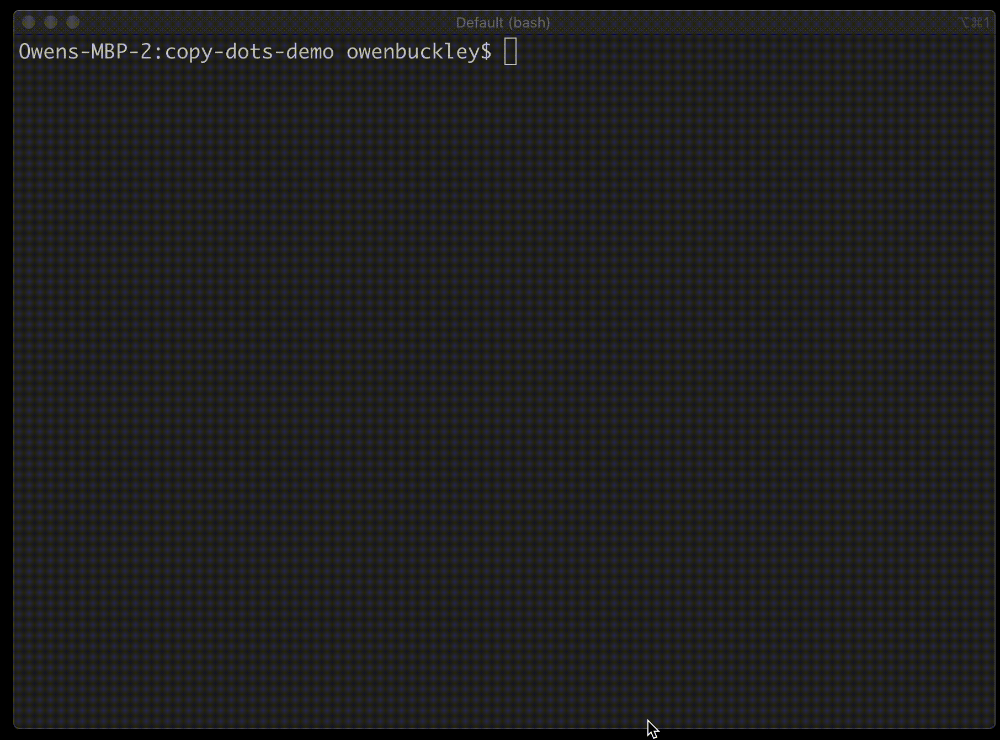

# copy-dots
[](https://github.com/thescientist13/copy-dots/tags)

[](https://github.com/thescientist13/copy-dots/issues)
[](https://raw.githubusercontent.com/thescientist13/copy-dots/master/LICENSE.md)

## Overview

Quickly copy dot files (and more!) from one project into another project with a single command.  Great for scaffolding or initializing a new project!  🚀


## Demo



> _**Note**: by default **copy-dots** will ignore any filename with that contains `"git"` in it to avoid clobbering your local directory by accident.  Fear not!  You can enable support for this using our options (below 👇)!_

## Setup
Make sure to have [latest NodeJS LTS](https://nodejs.org/) installed.

## Usage

**copy-dots** has one required paramater, which is a path.  Additional options available to include other file types / patterns.

### Path (required)

**copy-dots** at least needs to know what path to copy your files from.

```sh
$ npx copy-dots ../../my-project
```

### Options (Coming Soon!)

**copy-dots** also support the following options to copy additional files.

- -l (License), 
- -g (git)
- -r (readme), 
- -w (all the flags)
- -c (config files)